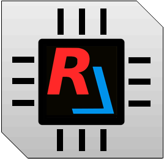
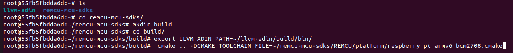
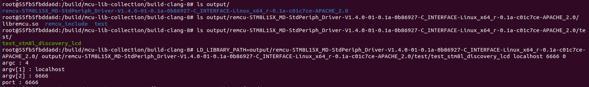
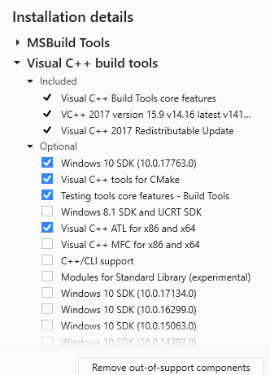
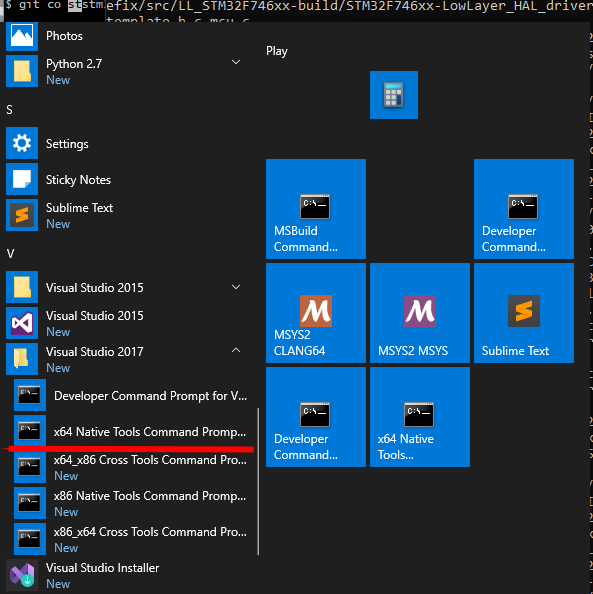
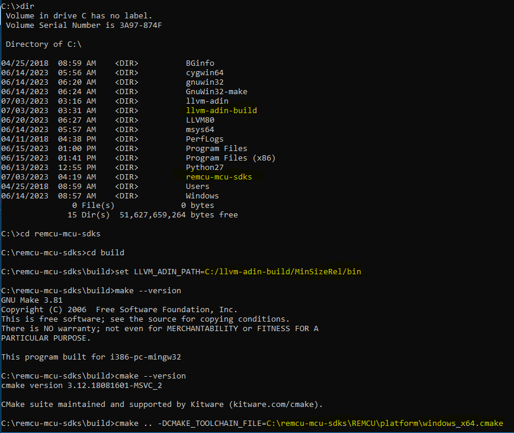

# REMCU CHIP SDK Collection

[](https://github.com/remotemcu/remcu-chip-sdks/actions/workflows/raspberry_pi_armv6_bcm2708.yml)
[](https://github.com/remotemcu/remcu-chip-sdks/actions/workflows/ubuntu.yml)
[](https://github.com/remotemcu/remcu-chip-sdks/actions/workflows/macos.yml)


---



1. [Overview](#overview)
2. [How to use](#how-to-use)
3. [How to build](#how-to-build)
   1. [Unix-like OS](#unix-like-os)
      1. [Docker way](#docker-way)
      2. [Without Docker](#without-docker)
   2. [Windows OS](#windows-os)
4. [Troubleshooting](#troubleshooting)


## Overview

The REMCU CHIP SDK Collection is a comprehensive compilation of prepared Microcontroller Unit (MCU) Software Development Kits (SDKs) sourced from various chip vendors. These SDKs have undergone meticulous customization and adaptation to seamlessly integrate with the [REMCU](https://github.com/remotemcu/remcu) library on multiple platforms, including Windows, Linux, and MacOS.This collection  empowers developers to remotely control MCUs from their PC applications using familiar APIs from the vendor SDKs made possible through the technology of [MCU Peripheral Forwarding](https://remotemcu.com/chip-peripheral-forwarding).

By leveraging the REMCU library, developers can seamlessly integrate the functions of the vendor SDKs into their PC applications. REMCU interrupts all peripheral operations, including storing and loading from registers, and executes them on the chip using OpenOCD or GDB server. This allows developers to conveniently and efficiently control the MCU's peripherals directly from their PC environment.

## How to use

just need to run some functions:


See [remcu examples repo](https://github.com/remotemcu/remcu_examples)

## How to build

### Unix-like OS

#### Docker way
To facilitate cross-compilation for Linux and Embedded Linux, you can utilize Docker images specifically designed for this purpose. Docker provides a convenient way to encapsulate the build environment and dependencies, ensuring consistency across different systems. You can use pre-built Docker images or create your own. Here's how you can use Docker for cross-compilation:

1. Install Docker:
   If you don't have Docker installed, follow the official Docker installation instructions for your operating system. Visit the Docker website (https://www.docker.com/) and download the appropriate version for your platform.

2. Pull the Docker Image:
   Once you have identified the appropriate Docker image, use the following command to pull the image from the Docker registry:
   ```bash
   docker pull sermkd/remcu_builder
   ```
3. Obtain the source code:
   - Clone the REMCU CHIP SDKs repository from GitHub using the following command:
     ```bash
     git clone --recurse-submodules https://github.com/remotemcu/remcu-chip-sdks.git
     ```

4. Run a Docker Container:
   Start a Docker container based on the pulled image using the following command:
   ```bash
   docker run -it --name remcu-build-docker -v $PWD/remcu-chip-sdks:/remcu-chip-sdks -w /remcu-chip-sdks remcu_builder
   ```

4. Configure REMCU Lib:
   - Create a build directory:
     ```bash
     mkdir build
     cd build
     ```

   - Configure the build using CMake, specifying the your platform toolchain file:
      for Linux x64
     ```bash
     cmake .. -DCMAKE_TOOLCHAIN_FILE=/remcu-chip-sdks/REMCU/platform/linux_x64.cmake
     ```
     for Raspberry V1:
    ```bash
     cmake .. -DCMAKE_TOOLCHAIN_FILE=/remcu-chip-sdks/REMCU/platform/raspberry_pi_armv6_bcm2708.cmake
     ```

4. To build a specific target, run:
   ```bash
   make <target>
   ```
   Replace `<target>` with the name of the specific target you want to build. For example, if you have a target named "STM8L15X_MD", the command will be:
   ```bash
   make STM8L15X_MD
   ```

     * To list all possible targets available on your platform, run:

      ```bash
      $ make help
      .....
      ... LL_STM32H750
      ... STM8L15X_MD
      ... LPC175X_6X
      ... EFM32TG840F32
      ... samd20
      ... MK64FN1M0VMD12
      ... XMC1100_series
      ```

    * To build all targets, simply run:
      ```bash
      make
      ```
      This command will build all the targets defined in the Makefile.

   After the build process completes successfully, the built library and tests will be located in the "output" directory. 
   ```bash
   $ ls output
   ...
   STM32F030-StdPeriph_Lib-V1.5.0-01
   STM32F042-StdPeriph_Lib-V1.5.0-01
   ...
   ```


#### Without Docker

I tested on ubuntu 16.04 and MacOS version

To build REMCU Library, please follow these steps:

1. Install the necessary dependencies:
   - CMake: Install CMake(3.5.1 or higher), which is used for building the project.
   - Git: Install Git, which is required for retrieving the source code.
   - Python: Install Python, as it is needed for certain build scripts.
   - Clang (**only version 8**): Install Clang version 8, as it is the required compiler for REMCU Toolkit.
   - Ninja (optional): Install Ninja, which is an optional build system that can provide faster build times.
   - Prebuilt [LLVM ADIN fork](https://github.com/remotemcu/adin-llvm)) or build manually


   To cross-compile for Raspberry Pi, you'll need to download the appropriate toolchain and install the necessary packages. Here are the steps to set up the cross-compilation environment:

   * Download the Toolchain https://github.com/raspberrypi/tools

   * Set the `RASPBERRY_TOOL_PATH` Environment Variable:
   Add the toolchain directory to the `RASPBERRY_TOOL_PATH` environment variable. This allows your system to find the cross-compilation tools without specifying the full path every time.
     ```bash
     export RASPBERRY_TOOL_PATH=/path/to/tools/
     ```
     *  Install Required Packages:
   Additionally, you'll need to install the necessary packages for cross-compilation on your development machine. These packages include development libraries, headers, and tools required by the Raspberry Pi.

   ```bash
      apt-get install gcc-multilib g++-multilib
   ```

2. Obtain the source code:
   - Clone the REMCU CHIP SDKs repository from GitHub using the following command:
     ```
     git clone --recurse-submodules https://github.com/remotemcu/remcu-chip-sdks.git
     ```

3. Get the prebuilt [LLVM ADIN fork](https://github.com/remotemcu/adin-llvm):
   - Visit the ADIN LLVM GitHub [release](https://github.com/remotemcu/adin-llvm/releases) and download the prebuilt LLVM ADIN fork package provided in the release section.
   - Extract the LLVM ADIN fork package to a directory of your choice.

   **or**

   Build [LLVM ADIN fork](https://github.com/remotemcu/adin-llvm) (optional):
   If you prefer to build LLVM ADIN fork yourself instead of using a prebuilt version, follow the instructions provided in the [ADIN LLVM repository](https://github.com/remotemcu/adin-llvm)) to build LLVM ADIN fork.

4. Configure REMCU Lib:
   - Open a terminal and navigate to the directory where you cloned the REMCU Library repository.
   - Create a build directory:
     ```
     cd remcu-chip-sdks
     mkdir build
     cd build
     ```

   - To specify the path to the built LLVM ADIN fork using the environment variable LLVM_ADIN_PATH and the bin directory where the opt utility is located, follow these steps:
   
      ```bash
      export LLVM_ADIN_PATH=/path/to/llvm_adin_fork/bin
      ```

   - Configure the build using CMake, specifying the your platform toolchain file:
      for Linux x64
     ```sh
     cmake .. -DCMAKE_TOOLCHAIN_FILE=path/to/remcu-chip-sdks/REMCU/platform/linux_x64.cmake
     ```
    for MacOS x64:
    ```sh
     cmake .. -DCMAKE_TOOLCHAIN_FILE=path/to/remcu-chip-sdks/REMCU/platform/macos_darwin_x64.cmake
     ```
     for Raspberry V1:
    ```sh
     cmake .. -DCMAKE_TOOLCHAIN_FILE=path/to/remcu-chip-sdks/REMCU/platform/raspberry_pi_armv6_bcm2708.cmake
     ```


   

5. To build a specific target, run:
   ```bash
   make <target>
   ```
   Replace `<target>` with the name of the specific target you want to build. For example, if you have a target named "STM8L15X_MD", the command will be:
   ```bash
   make STM8L15X_MD
   ```

     * To list all possible targets available on your platform, run:

      ```bash
      $ make help
      .....
      ... LL_STM32H750
      ... STM8L15X_MD
      ... LPC175X_6X
      ... EFM32TG840F32
      ... samd20
      ... MK64FN1M0VMD12
      ... XMC1100_series
      ```

    * To build all targets, simply run:
      ```bash
      make
      ```
      This command will build all the targets defined in the Makefile.

   After the build process completes successfully, the built library and tests will be located in the "output" directory. 
   ```bash
   $ ls output
   ...
   STM32F030-StdPeriph_Lib-V1.5.0-01
   STM32F042-StdPeriph_Lib-V1.5.0-01
   ...
   ```

#### How run tests

When using REMCU on a Unix-like system (Linux, macOS, etc.), you should set the LD_LIBRARY_PATH environment variable to the path containing the libremcu.so shared library. This ensures that the test binary can find and load the REMCU library during runtime.

```shell
LD_LIBRARY_PATH=output/remcu-STM8L15X_MD-StdPeriph_Driver-V1.4.0-01/ output/remcu-STM8L15X_MD-StdPeriph_Driver-V1.4.0-01/test/test_stm8l_discovery_lcd localhost 6666 0
```




### Windows OS


Note that this guide assumes you are building on a Windows system and requires MSBuild from Visual Studio 2017.


#### Prerequisites

Before proceeding with the LLVM Adin Fork build, ensure that you have the following prerequisites installed on your Windows machine:

1. **MSBuild:** Install Microsoft Build Tools or Visual Studio 2017. You can download Visual Studio 2017 Community Edition from the official Microsoft website: [https://learn.microsoft.com/en-us/previous-versions/visualstudio/visual-studio-2017/install/use-command-line-parameters-to-install-visual-studio?view=vs-2017](https://learn.microsoft.com/en-us/previous-versions/visualstudio/visual-studio-2017/install/use-command-line-parameters-to-install-visual-studio?view=vs-2017) or https://aka.ms/vs/15/release/vs_BuildTools.exe. Make sure to select the required these components during the installation.

   


I build with next version:
```
  -- Selecting Windows SDK version 10.0.17763.0 to target Windows 10.0.17134.
  -- The C compiler identification is MSVC 19.16.27050.0
  -- The CXX compiler identification is MSVC 19.16.27050.0
```

2. **Python:** Install Python on your system. You can download the latest Python version from the official Python website: [https://www.python.org/downloads/windows/](https://www.python.org/downloads/windows/). Choose the appropriate version for your system (64-bit) and follow the installation instructions.

3. **Git:** Install Git version control system. You can download Git from the official Git website: [https://git-scm.com/downloads](https://git-scm.com/downloads). Choose the appropriate installer for your system and run the installation.

4. **Make** for Windows https://gnuwin32.sourceforge.net/packages/make.htm (tested GNU Make 3.81)

- Ninja (optional): Install Ninja, which is an optional build system that can provide faster build times.

5. Prebuilt [LLVM ADIN fork](https://github.com/remotemcu/adin-llvm)) or build manually

6. Clang (**only version 8**): Install Clang version 8, as it is the required compiler for REMCU Toolkit. https://releases.llvm.org/8.0.0/LLVM-8.0.0-win64.exe
   

#### Build

1. Clone the Repository:
   ```shell
   git clone --recurse-submodules https://github.com/remotemcu/remcu-chip-sdks.git
   ```

2.  Open "x64 Native Tools Command Prompt for Visual Studio 2017" entry to open the command prompt.

   

   Go to Cloned Directory:
   Change the current directory to the cloned repository directory by running the following command in the command prompt:
   ```bash
   cd <cloned_repository_directory>
   ```
   Replace `<cloned_repository_directory>` with the path to the cloned repository on your machine.

   Create dir for build

3. To specify the path to the built LLVM ADIN fork using the environment variable LLVM_ADIN_PATH and the bin directory where the opt utility is located,  in **Unix-style (Linux/macOS) with the path separator '/' for directories**, use the following command:
   ```sh
      set LLVM_ADIN_PATH=/path/to/llvm_adin_fork/bin/
   ```


4. Run CMake:
Use CMake to configure the build. CMake generates the necessary build files based on the project's CMakeLists.txt file. Run the following command in the command prompt to configure the build inside the "build" directory:

   ```shell
   cmake -G "Unix Makefiles" .. -DCMAKE_TOOLCHAIN_FILE=path/to/remcu-chip-sdks/REMCU/platform/windows_x64.cmake
   ```



If failed, try :
   ```shell
   cmake -G "Unix Makefiles" .. -DCMAKE_TOOLCHAIN_FILE=path/to/remcu-chip-sdks/REMCU/platform/windows_x64_clang.cmake
   ```

5. To build a specific target, run:

   ```bash
   make <target>
   ```
   Replace `<target>` with the name of the specific target you want to build. For example, if you have a target named "STM8L15X_MD", the command will be:

   ```bash
   make STM8L15X_MD
   ```

   

     * To list all possible targets available on your platform, run:

      ```shell
      $ make help
      .....
      ... LL_STM32H750
      ... STM8L15X_MD
      ... LPC175X_6X
      ... EFM32TG840F32
      ... samd20
      ... MK64FN1M0VMD12
      ... XMC1100_series
      ```

    * To build all targets, simply run:
      ```bash
      make
      ```
      This command will build all the targets defined in the Makefile.

   After the build process completes successfully, the built library and tests will be located in the "output" directory. 
   ```cmd
   $ dir output
   ...
   STM32F030-StdPeriph_Lib-V1.5.0-01
   STM32F042-StdPeriph_Lib-V1.5.0-01
   ...
   ```

#### How run test binary

to successfully run the test binary that utilizes REMCU, you should ensure that the remcu.dll library is accessible from the directory where you execute the test executable.


## Troubleshooting

* If you encounter error messages such as 

   ```shell
      (ERROR)$#/#:207: Can't read value from addr: 0x40013008, typesize: 16
      (ERROR)$#/#:141: can't parse answer of server: [31] invalid command name "ocd_mdh"�
   ```

    during the usage of REMCU and the OpenOCD server, it is advisable to check the version of OpenOCD you are using. It is highly recommended to use [OpenOCD version v0.10.0-12](https://github.com/ilg-archived/openocd/releases/tag/v0.10.0-12-20190422).

    Using the recommended version of OpenOCD ensures better compatibility and stability with REMCU. If you are unable to change the OpenOCD version for any reason, an alternative solution is to utilize the GDB server instead of the OpenOCD server. You can achieve this by utilizing the **remcu_connect2GDB** function to connect to the GDB server.

    ```c
    remcu_connect2GDB("localhost", 3333, 0);
    ```


* If you encounter an error message like:

   ```sh
      "/build/build_llvm_8_adin/bin//opt" -adin -S /build/mcu-lib-collection/build-clang-8/stm32/stm32f3/STM32F3-Discovery_FW_V1.1.0-prefix/src/STM32F3-Discovery_FW_V1.1.0-build/STM32F30X-StdPeriph_Lib-V1.1.0-01/system_stm32f30x.c.ll -o  /build/mcu-lib-collection/build-clang-8/stm32/stm32f3/STM32F3-Discovery_FW_V1.1.0-prefix/src/STM32F3-Discovery_FW_V1.1.0-build/STM32F30X-StdPeriph_Lib-V1.1.0-01/system_stm32f30x.c.adin.ll
         /build/build_llvm_8_adin/bin//opt: /build/mcu-lib-collection/build-clang-8/stm32/stm32f3/STM32F3-Discovery_FW_V1.1.0-prefix/src/STM32F3-Discovery_FW_V1.1.0-build/STM32F30X-StdPeriph_Lib-V1.1.0-01/system_stm32f30x.c.ll:312:200: error: invalid field 'variables'
         !62 = distinct !DISubprogram(name: "SystemInit", scope: !3, file: !3, line: 169, type: !63, isLocal: false, isDefinition: true, scopeLine: 170, flags: DIFlagPrototyped, isOptimized: false, unit: !2, variables: !65)
                                                                                                                                                                                                                ^
         /build/REMCU/platform/..//mcu_utils//common.mk:56: recipe for target 'Libraries/CMSIS/Device/ST/STM32F30x/Source/Templates/system_stm32f30x.ll' failed
   ```

   during the build process, specifically after the instrumentation operation using `opt`, it is recommended to check the versions of Clang and the ADIN `opt` tool. To ensure compatibility and avoid such errors, both Clang and ADIN opt should be version 8.0.0.

   ```sh
      $ $LLVM_ADIN_PATH/opt --version
         LLVM (http://llvm.org/):
           LLVM version 8.0.0svn
           Optimized build.
           Default target: x86_64-unknown-linux-gnu
           Host CPU: icelake-client

       $ clang --version
      clang version 8.0.0-3~ubuntu16.04.1 (tags/RELEASE_800/final)
      Target: x86_64-pc-linux-gnu
      Thread model: posix
      InstalledDir: /usr/lib/llvm-8/bin

   ```

   Mismatched versions of Clang and ADIN opt may result in compatibility issues and error messages during the build process. Therefore, it is crucial to ensure that you are using the correct versions to maintain a smooth and successful build
